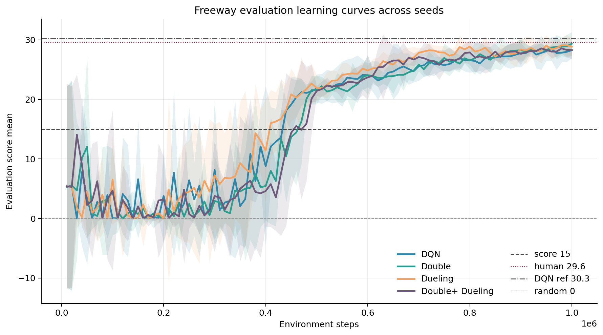
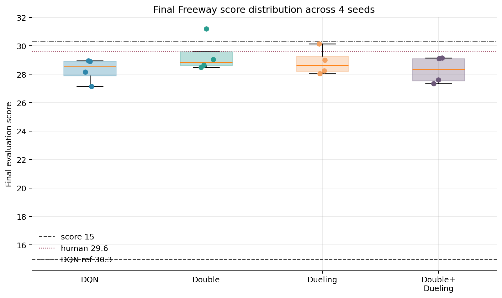
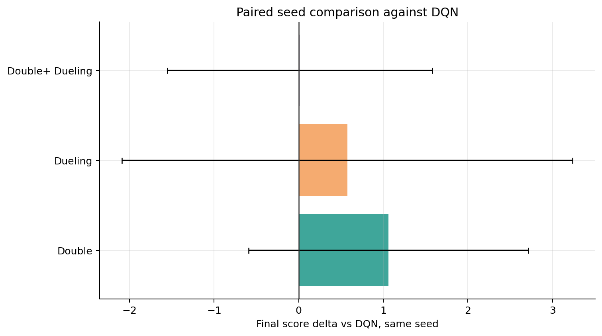
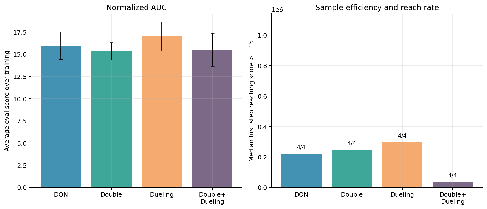
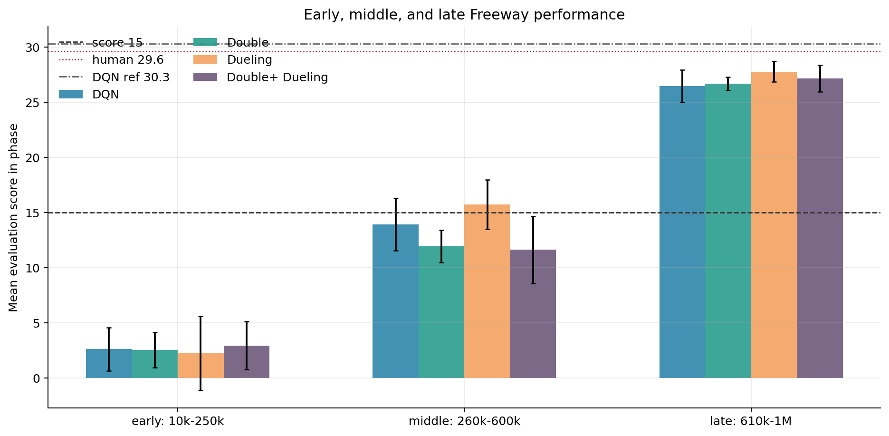
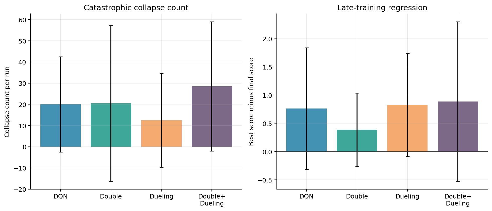
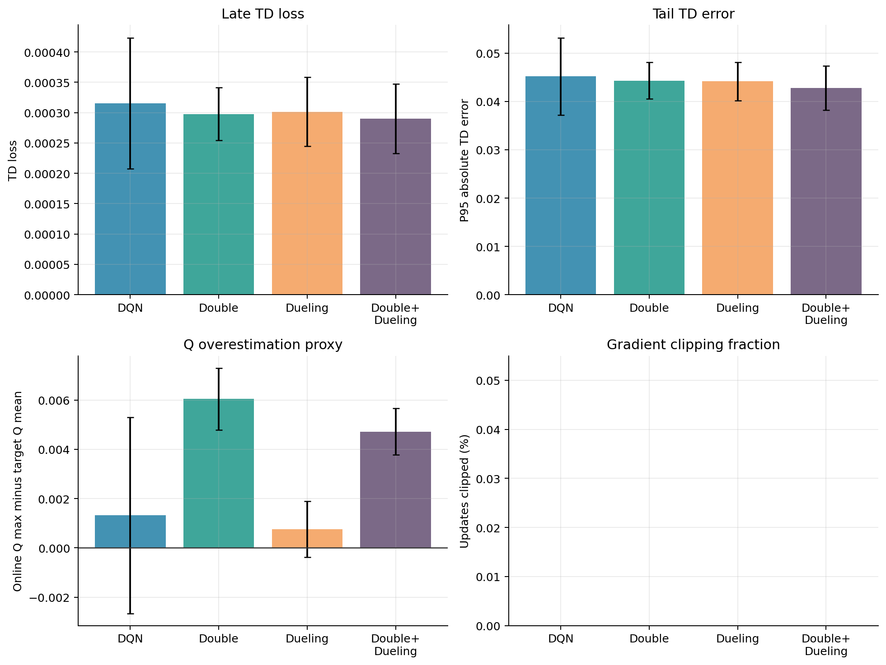
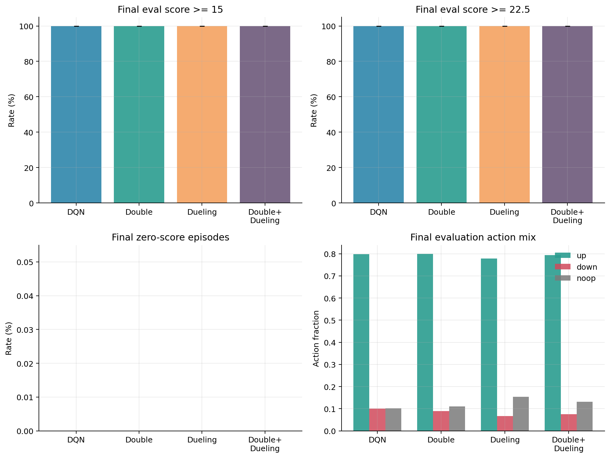

# Freeway Up-Biased DQN Report

## Data and Method

This report analyzes `output/run_freeway_upbiased_20260520_110511/freeway/` with the four requested variants: DQN, Double DQN, Dueling DQN, and Double + Dueling DQN. There are 16 completed runs, with 4 seeds per variant. Each run used 1,000,000 environment steps, about 4,000,000 ALE frames, and Freeway up-bias `0.50` during exploration. The success threshold is score >= 15.0.

All statistics are computed from `summary.json`, `eval_metrics.jsonl`, and `train_update_metrics.jsonl`. Intervals are 95 percent t-intervals across seeds. With 4 seeds per variant, these intervals are uncertainty estimates rather than strong significance claims.

Figures:

## Overall Performance Summary

| Variant | Seeds | Final score mean +/- CI | Seed std | Best score mean +/- CI | Norm. AUC mean +/- CI | Final >=15 | Reached 15 | Reached 22.5 | Median first >=15 | Collapses/run | Best-final gap |
| --- | --- | --- | --- | --- | --- | --- | --- | --- | --- | --- | --- |
| DQN baseline | 4 | 28.29 +/- 1.34 | 0.84 | 29.05 +/- 1.40 | 15.96 +/- 1.56 | 4/4 | 4/4 | 4/4 | 220,000 | 20.0 | 0.76 |
| Double DQN | 4 | 29.35 +/- 2.00 | 1.25 | 29.74 +/- 1.62 | 15.33 +/- 0.98 | 4/4 | 4/4 | 4/4 | 245,000 | 20.5 | 0.39 |
| Dueling DQN | 4 | 28.86 +/- 1.51 | 0.95 | 29.69 +/- 0.87 | 17.01 +/- 1.63 | 4/4 | 4/4 | 4/4 | 295,000 | 12.5 | 0.83 |
| Double + Dueling DQN | 4 | 28.30 +/- 1.52 | 0.96 | 29.19 +/- 0.32 | 15.51 +/- 1.86 | 4/4 | 4/4 | 4/4 | 35,000 | 28.5 | 0.89 |

The strongest final mean score is from Double DQN at 29.35 +/- 2.00. The strongest whole-training average is from Dueling DQN at 17.01 +/- 1.63 normalized AUC. The most stable variant by collapse count and best-final gap is Dueling DQN.

Per-seed final scores:

| Seed | DQN | Double | Dueling | Double+ Dueling |
| --- | --- | --- | --- | --- |
| 0 | 28.90 | 28.65 | 28.05 | 29.10 |
| 1 | 27.15 | 28.50 | 30.15 | 27.35 |
| 2 | 28.95 | 31.20 | 29.00 | 27.60 |
| 3 | 28.15 | 29.05 | 28.25 | 29.15 |

Paired comparison against DQN:

| Variant vs DQN | Final score delta | Seed win rate | Norm. AUC delta | First >=15 step delta | Collapse delta |
| --- | --- | --- | --- | --- | --- |
| Double DQN | 1.06 +/- 1.65 | 75% | -0.63 +/- 1.40 | 40000 +/- 268435 | 0.5 +/- 25.1 |
| Dueling DQN | 0.58 +/- 2.66 | 75% | 1.05 +/- 2.68 | 47500 +/- 459718 | -7.5 +/- 42.7 |
| Double + Dueling DQN | 0.01 +/- 1.56 | 75% | -0.45 +/- 3.08 | -52500 +/- 424209 | 8.5 +/- 36.6 |

## Baseline DQN

Baseline DQN with experience replay and a periodically copied target network. It finished with mean score 28.29 +/- 1.34 and reached score 15 in all 4 seeds. It also reached score 22.5 in all 4 seeds. Its normalized AUC was 15.96 +/- 1.56.

The baseline is a strong reference for this up-biased setting. Its final score is close to the human reference score of 29.6, but its average best-final gap of 0.76 shows some late loss from the best checkpoint.

## Double DQN

Double DQN uses the online network to select the next action and the target network to evaluate it. It finished with mean score 29.35 +/- 2.00, reached score 15 in all 4 seeds, and reached score 22.5 in all 4 seeds.

Against DQN on matched seeds, it changed final score by 1.06 +/- 1.65, won 75% of seeds, had -0.63 +/- 1.40 normalized-AUC delta, and had a first-reach delta of +40000 steps. Double DQN had the strongest mean final score in this run. Its Q-overestimation proxy was 0.0060, compared with 0.0013 for DQN, so the score result should be read together with the full learning curve rather than from that proxy alone.

## Dueling DQN

Dueling DQN splits the network head into state-value and action-advantage streams. It finished with mean score 28.86 +/- 1.51, reached score 15 in all 4 seeds, and reached score 22.5 in all 4 seeds.

Against DQN on matched seeds, it changed final score by 0.58 +/- 2.66, won 75% of seeds, had 1.05 +/- 2.68 normalized-AUC delta, and had a first-reach delta of +47500 steps. Dueling DQN had the strongest whole-training AUC in this run. Its average collapse count was 12.5, compared with 20.0 for DQN.

## Double + Dueling DQN

Double + Dueling DQN combines Double DQN target selection with the dueling architecture. It finished with mean score 28.30 +/- 1.52, reached score 15 in all 4 seeds, and reached score 22.5 in all 4 seeds.

Against DQN on matched seeds, it changed final score by 0.01 +/- 1.56, won 75% of seeds, had -0.45 +/- 3.08 normalized-AUC delta, and had a first-reach delta of -52500 steps. The combined variant did not clearly inherit the best property of each separate extension.

## Optimization, Q-Value, and Behavior Diagnostics

The optimization diagnostics are best used as explanations after checking evaluation score. Low TD loss does not automatically mean a better Freeway policy, and Q scale can differ across variants.

Final evaluation behavior summary:

| Variant | Final score mean +/- CI | Score >=15 | Score >=22.5 | Zero score | Up action | Down action | Noop action |
| --- | --- | --- | --- | --- | --- | --- | --- |
| DQN baseline | 28.29 +/- 1.34 | 100% | 100% | 0% | 80% | 10% | 10% |
| Double DQN | 29.35 +/- 2.00 | 100% | 100% | 0% | 80% | 9% | 11% |
| Dueling DQN | 28.86 +/- 1.51 | 100% | 100% | 0% | 78% | 7% | 15% |
| Double + Dueling DQN | 28.30 +/- 1.52 | 100% | 100% | 0% | 79% | 7% | 13% |

The behavior table and figure show that all variants avoid zero-score episodes at the end, so the main comparison is score quality and action mix rather than basic task discovery.

## Main Conclusions

All four requested variants learned useful Freeway policies under the up-biased exploration setting. Every seed reached the configured score-15 threshold, so final quality, whole-training AUC, and late stability are more informative than simple success rate.

Double DQN had the best final mean score. Dueling DQN had the best normalized AUC, which means it had the strongest score profile over the full 1M-step budget.

The combined Double + Dueling variant was not automatically better than the separate extensions in this run. The result supports comparing these variants by matched seeds and learning curves, not only by their architectural intent.
