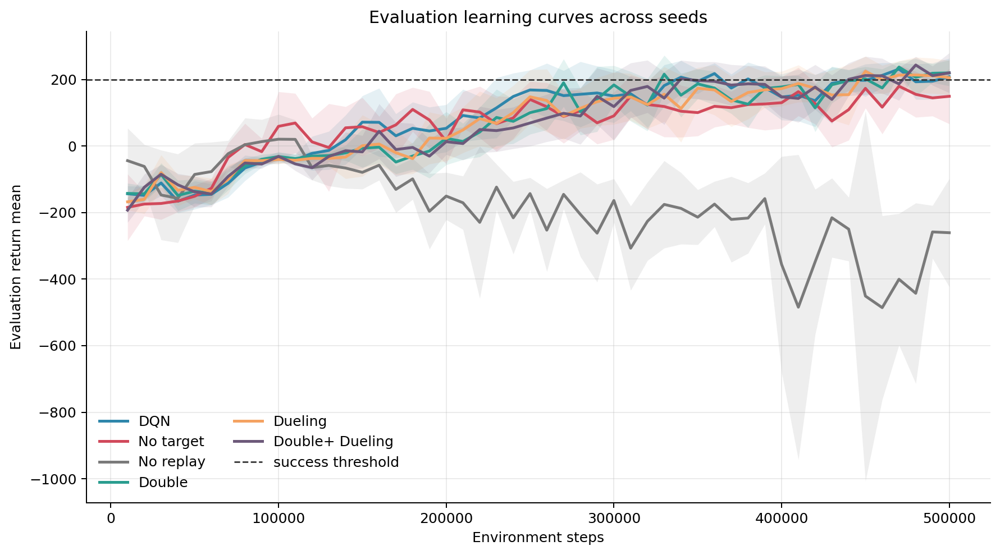
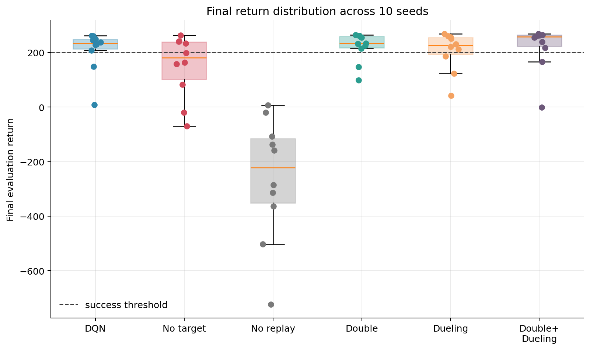
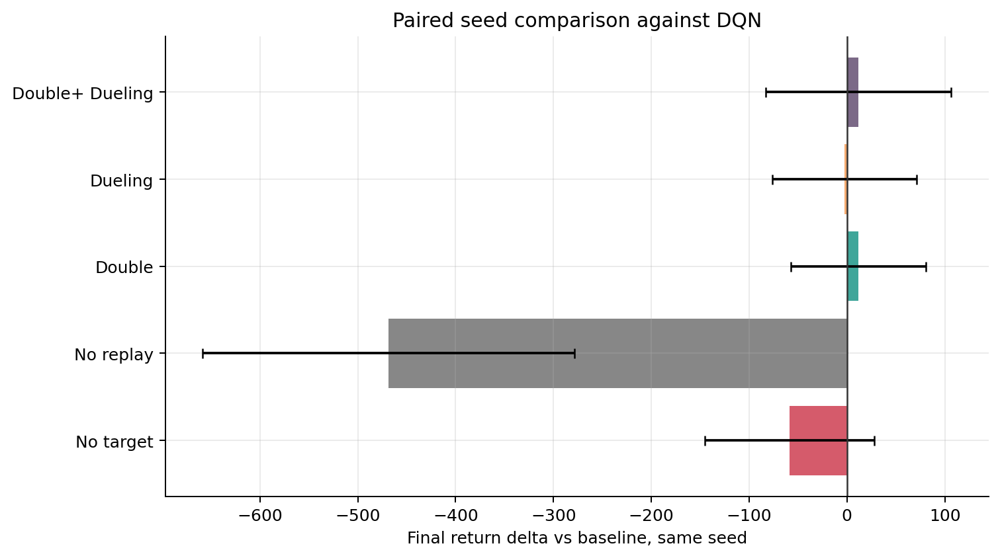
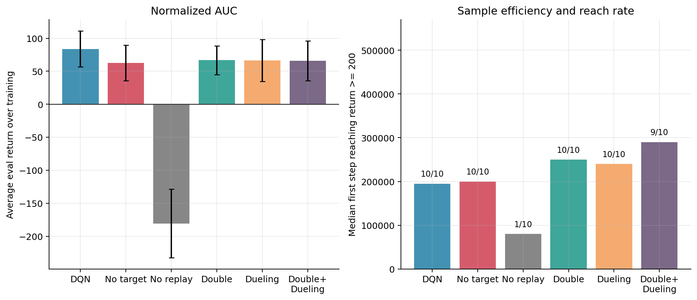
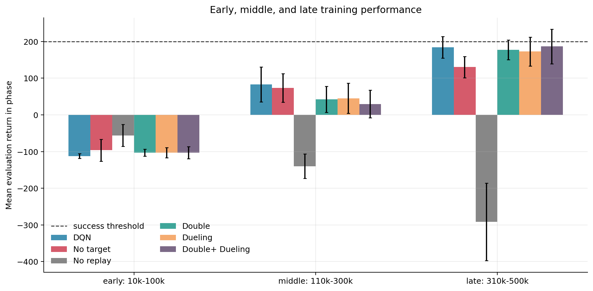
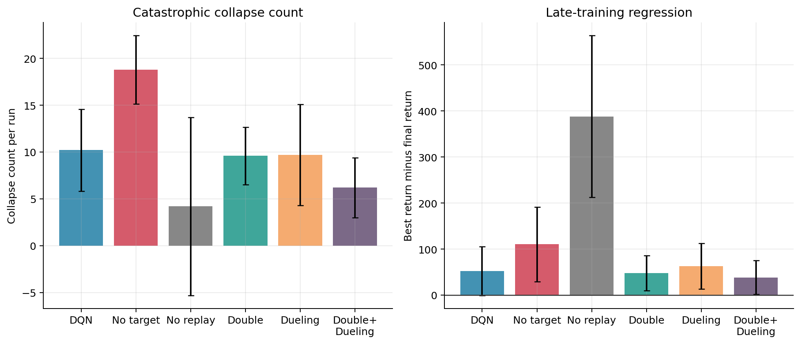
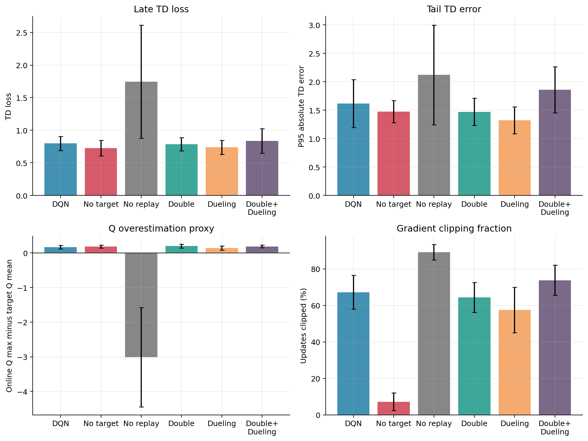
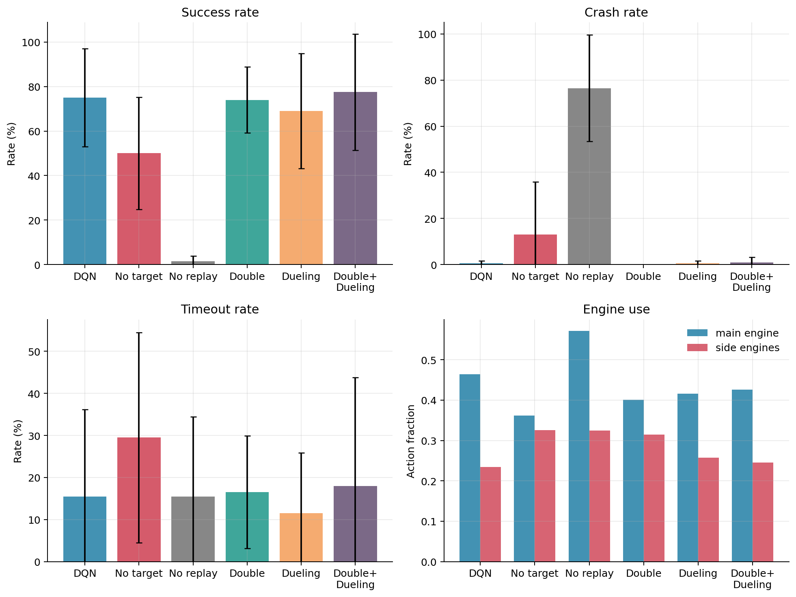

# LunarLander Report: 10 Seeds

## Data and Method

This report analyzes the completed `output/full_lunarlander_10seeds_20260516_042845/lunarlander_v3/` runs. There are 60 runs: six DQN variants with 10 seeds each. Every run used a budget of 500,000 environment steps, and the success threshold is return >= 200. The analysis uses the latest completed run under each variant/seed directory.

The statistics below are computed with numpy and pandas from `summary.json`, `eval_metrics.jsonl`, and the update logs. Intervals are 95 percent t-intervals across seeds. With 10 seeds per variant, the intervals should be read as uncertainty estimates, not as formal proof.

Figures:

## Overall Performance Summary

| Variant | Seeds | Final return mean +/- CI | Seed std | Best return mean +/- CI | Norm. AUC mean +/- CI | Reached 200 | Median first reach | Collapses/run | Best-final gap |
| --- | --- | --- | --- | --- | --- | --- | --- | --- | --- |
| DQN baseline | 10 | 208.0 +/- 55.6 | 77.7 | 260.2 +/- 13.0 | 83.9 +/- 27.3 | 10/10 | 195,000 | 10.2 | 52.2 |
| DQN without target network | 10 | 149.3 +/- 82.8 | 115.8 | 259.8 +/- 7.1 | 62.6 +/- 26.9 | 10/10 | 200,000 | 18.8 | 110.5 |
| DQN without replay buffer | 10 | -260.6 +/- 162.6 | 227.3 | 127.6 +/- 40.1 | -180.6 +/- 51.8 | 1/10 | 80,000 | 4.2 | 388.2 |
| Double DQN | 10 | 219.7 +/- 39.0 | 54.5 | 267.2 +/- 4.0 | 66.7 +/- 22.0 | 10/10 | 250,000 | 9.6 | 47.6 |
| Dueling DQN | 10 | 205.5 +/- 51.6 | 72.1 | 268.3 +/- 7.6 | 66.2 +/- 31.8 | 10/10 | 240,000 | 9.7 | 62.8 |
| Double + Dueling DQN | 10 | 219.8 +/- 60.1 | 84.0 | 258.3 +/- 25.9 | 65.7 +/- 30.1 | 9/10 | 290,000 | 6.2 | 38.4 |

The strongest final mean return is from Double + Dueling DQN at 219.8 +/- 60.1. The strongest whole-training average is from DQN baseline at 83.9 +/- 27.3 normalized AUC. This difference is important: final score rewards the last checkpoint, while normalized AUC rewards being good for more of training.

Per-seed final returns:

| Seed | DQN | No target | No replay | Double | Dueling | Double+ Dueling |
| --- | --- | --- | --- | --- | --- | --- |
| 0 | 250.4 | 199.2 | -20.3 | 264.2 | 251.5 | 264.9 |
| 1 | 231.4 | 233.1 | -107.7 | 260.7 | 257.1 | 255.1 |
| 2 | 7.8 | 163.9 | 7.1 | 232.7 | 186.6 | 263.1 |
| 3 | 262.4 | 263.0 | -158.9 | 147.8 | 222.2 | -1.5 |
| 4 | 148.9 | -19.7 | -285.8 | 234.3 | 231.0 | 268.5 |
| 5 | 207.5 | -69.5 | -136.9 | 99.3 | 268.9 | 238.5 |
| 6 | 228.7 | 241.1 | -501.9 | 254.9 | 123.1 | 266.2 |
| 7 | 237.1 | 82.4 | -723.5 | 225.6 | 41.8 | 166.2 |
| 8 | 260.7 | 157.5 | -313.7 | 261.9 | 260.8 | 217.3 |
| 9 | 245.3 | 242.1 | -364.3 | 215.2 | 211.9 | 260.3 |

Paired comparison against baseline:

| Variant vs DQN | Final return delta | Seed win rate | Norm. AUC delta | First-reach step delta | Collapse delta |
| --- | --- | --- | --- | --- | --- |
| DQN without target network | -58.7 +/- 86.8 | 40% | -21.2 +/- 38.9 | -27000 +/- 76303 | 8.6 +/- 4.6 |
| DQN without replay buffer | -468.6 +/- 190.1 | 0% | -264.5 +/- 51.6 | -280000 | -6.0 +/- 11.8 |
| Double DQN | 11.6 +/- 69.1 | 60% | -17.2 +/- 32.5 | 48000 +/- 56303 | -0.6 +/- 4.9 |
| Dueling DQN | -2.5 +/- 73.5 | 60% | -17.6 +/- 23.4 | 42000 +/- 76285 | -0.5 +/- 6.6 |
| Double + Dueling DQN | 11.8 +/- 94.8 | 70% | -18.2 +/- 46.4 | 42222 +/- 61587 | -4.0 +/- 3.9 |

## Baseline DQN Performance Study

The baseline DQN reached the success threshold at least once in all 10 seeds. Its final mean return was 208.0 +/- 55.6, with a seed standard deviation of 77.7. Its best mean return was 260.2 +/- 13.0, and its median first step reaching the success threshold was 195,000.

The baseline's main strength is early sample efficiency. Its normalized AUC was 83.9 +/- 27.3, the highest among these variants. The learning-curve and phase-return figures show how quickly baseline DQN became useful compared with the extensions.

The weakness is retention. The average best-final gap was 52.2, and the average collapse count was 10.2 per run. 2 baseline seeds finished below the success threshold: 2, 4. This means the baseline often found a good policy, but the final checkpoint was not always the best policy.

## Ablation: Removing the Target Network

Removes the target network, so the bootstrap target moves with the online network. The final mean return was 149.3 +/- 82.8, lower than baseline. It still reached the 200 threshold in 10/10 seeds, but its median first reach step was 200,000, slower than baseline's 195,000.

Against baseline on matched seeds, it changed final return by -58.7 +/- 86.8, won 40% of seeds, had -21.2 +/- 38.9 normalized-AUC delta, and had a first-reach delta of -27000 steps. The stability diagnostics are the clearest warning sign: the no-target variant averaged 18.8 collapses per run, compared with 10.2 for baseline. This matches the expected role of a target network. Without a slower-moving bootstrap target, the value update target is less stable.

## Ablation: Removing Replay

Removes replay, so updates use recent correlated transitions with little sample reuse. This was the clearest failure. Final mean return was -260.6 +/- 162.6, and it reached the success threshold in 1/10 seeds. Its normalized AUC was -180.6 +/- 51.8, far below every replay-based variant.

Against baseline on matched seeds, it changed final return by -468.6 +/- 190.1, won 0% of seeds, had -264.5 +/- 51.6 normalized-AUC delta, and had a first-reach delta of -280000 steps. The collapse count is 4.2, but that is not a sign of stability by itself. Interpret this collapse count together with the low threshold reach rate, because weak runs can have few collapses simply by spending little time in a successful regime. The result shows that replay is not just an implementation detail here; it is the core mechanism that gives DQN enough decorrelated and reused experience to learn LunarLander.

## Extension: Double DQN

Uses the online network to select the next action and the target network to evaluate it. Double DQN produced a final mean return of 219.7 +/- 39.0, above baseline. It reached the threshold in all 10 seeds and had a final solved count of 8/10. Its median first reach step was 250,000, so it was slower to cross the threshold than baseline, but it ended with a better final policy.

Against baseline on matched seeds, it changed final return by 11.6 +/- 69.1, won 60% of seeds, had -17.2 +/- 32.5 normalized-AUC delta, and had a first-reach delta of +48000 steps. The Q-overestimation proxy was 0.198 for Double DQN and 0.167 for baseline. This proxy did not decrease, so the performance gain should not be described as proven lower overestimation from this single metric. A safer interpretation is that Double DQN improved final policy quality and reliability even though the logged proxy is sensitive to Q-value scale and late-training state distribution.

## Extension: Dueling DQN

Splits the network head into state-value and action-advantage streams. Dueling DQN had final mean return 205.5 +/- 51.6; the strongest final mean in this result set was Double + Dueling DQN at 219.8 +/- 60.1. It solved at the end in 7/10 seeds and reached the threshold in all 10 seeds. Its average collapse count was 9.7, lower than the baseline value of 10.2.

Against baseline on matched seeds, it changed final return by -2.5 +/- 73.5, won 60% of seeds, had -17.6 +/- 23.4 normalized-AUC delta, and had a first-reach delta of +42000 steps. The tradeoff is speed. Its median first reach step was 240,000, slower than baseline. In this 10-seed result set, the dueling head slightly reduced collapse count but did not improve mean final return over baseline, so its benefit is weaker than in the earlier five-seed summary.

## Extension: Double + Dueling DQN

Combines Double DQN target selection with the dueling value/advantage architecture. The combined variant had final mean return 219.8 +/- 60.1, with a seed standard deviation of 84.0 and a final solved count of 8/10.

Against baseline on matched seeds, it changed final return by 11.8 +/- 94.8, won 70% of seeds, had -18.2 +/- 46.4 normalized-AUC delta, and had a first-reach delta of +42222 steps. This means the combination can work very well, but in this result set it is less reliable than using the dueling head alone when its seed spread is larger or its final solved count is lower.

## Optimization, Q-Value, and Behavior Diagnostics

The optimization figure shows that the no-replay variant had the largest late TD loss and a poor final policy. This supports the interpretation that removing replay makes the Bellman regression problem harder and less useful. Dueling DQN had the lowest Q-overestimation proxy among the strong final performers, while Double DQN had high final return even though this proxy was not lower than baseline.

Final evaluation behavior summary:

| Variant | Success | Landing success | Crash | Timeout | Main engine | Side engines |
| --- | --- | --- | --- | --- | --- | --- |
| DQN baseline | 75% | 75% | 0% | 16% | 46% | 23% |
| DQN without target network | 50% | 50% | 13% | 30% | 36% | 33% |
| DQN without replay buffer | 2% | 2% | 76% | 16% | 57% | 33% |
| Double DQN | 74% | 74% | 0% | 16% | 40% | 31% |
| Dueling DQN | 69% | 69% | 0% | 12% | 42% | 26% |
| Double + Dueling DQN | 78% | 78% | 1% | 18% | 43% | 25% |

The behavior figure connects return to LunarLander outcomes. Good variants show higher final success and lower crash/timeout rates. Engine-use fractions help distinguish controlled landings from hovering or unstable correction.

## Main Conclusions

Experience replay is essential in this experiment. Removing replay reached the success threshold in only 1/10 seeds and had the worst normalized AUC.

The target network matters for stability. Removing it did not make learning impossible, but it lowered final performance and increased collapse frequency.

Baseline DQN learned early, which gave it the best normalized AUC, but it often failed to retain its best policy until the final checkpoint.

Double + Dueling DQN had the strongest final mean return, while baseline DQN kept the best normalized AUC.

Double DQN improved final return, but the logged overestimation proxy alone does not prove a clean reduction in overestimation for these runs.

Double + Dueling DQN showed high upside but worse reliability than Dueling DQN alone in this result set.
