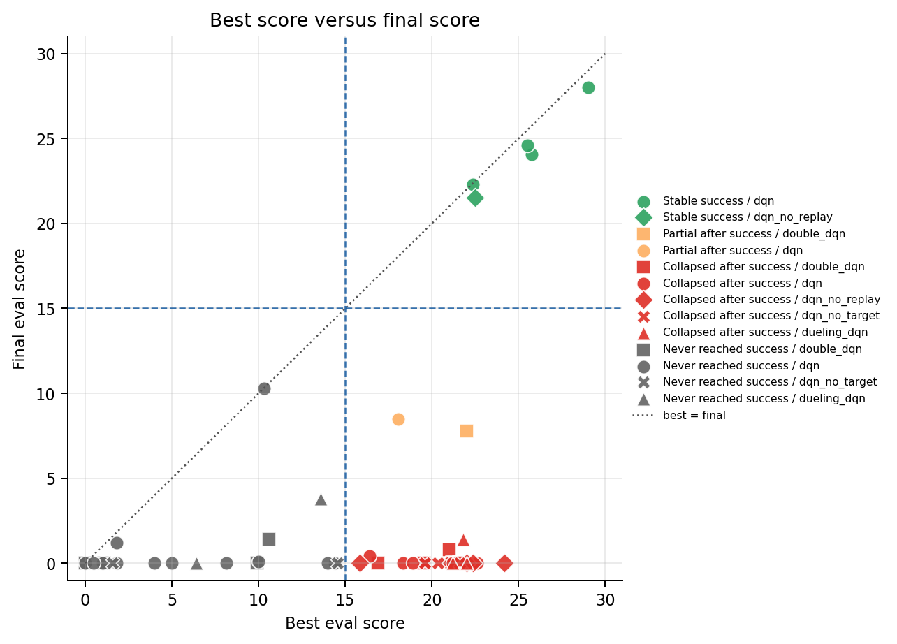
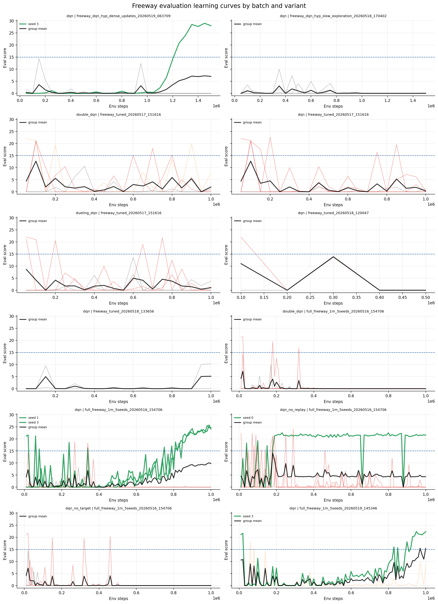
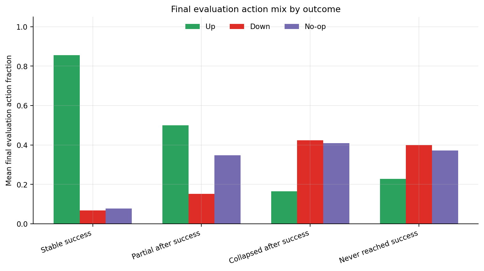
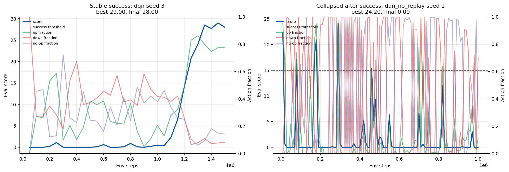
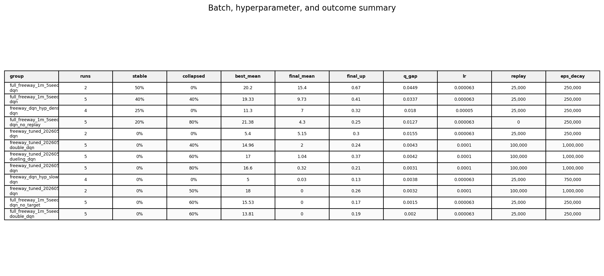

# Freeway Training Stability Report

## Executive summary

The main failure mode is policy collapse, not numeric instability. Across 49 Freeway runs and 2790 evaluation records, only 5 runs finish at or above the success threshold of 15 points. 22 runs reach that threshold at least once but later finish below 5 points, 2 finish in the middle, and 20 never reach the threshold.

The rare successful runs keep moving upward late in training. Their mean final score is 24.09, their final evaluation upward-action fraction is 0.855, their late Q-value action gap is 0.05926, and their late replay reward mean is 0.01113. The collapsed-after-success runs have mean final score 0.12, final zero-score rate 91.8%, upward-action fraction 0.165, late Q-value action gap 0.0053, and late replay reward mean 0.000069. In plain terms, the failing agents stop preferring the upward action strongly enough, then almost never see positive Freeway rewards in the replay samples.

Numeric failure flags are rare (gradient-explosion: 1). They do not match the broad pattern of collapse, because most failed runs end with low upward-action preference, sparse replay rewards, and tiny Q-action gaps rather than logged numerical blow-up. The final policies usually have low upward-action fractions and high down/no-op fractions, which makes a zero score the natural result in Freeway.

## Data inventory

The script scans `output/**/freeway/**/run_config.json` and loads the run-local JSONL files. It does not rely on `aggregate_summary.json`, because some batches do not have one.

| batch                                            | variant       | runs | seeds         | steps     | eval freq | lr       | replay  | starts  | train freq | target freq | eps decay | eps final |
| ------------------------------------------------ | ------------- | ---- | ------------- | --------- | --------- | -------- | ------- | ------- | ---------- | ----------- | --------- | --------- |
| freeway_dqn_hyp_dense_updates_20260519_063709    | dqn           | 4    | 0, 1, 2, 3    | 1,500,000 | 50,000    | 0.00005  | 25,000  | 20,000  | 2          | 4,000       | 250,000   | 0.01      |
| freeway_dqn_hyp_slow_exploration_20260518_170402 | dqn           | 4    | 0, 1, 2, 3    | 1,500,000 | 50,000    | 0.000063 | 25,000  | 20,000  | 4          | 8,000       | 750,000   | 0.03      |
| freeway_tuned_20260517_151616                    | double_dqn    | 5    | 0, 1, 2, 3, 4 | 1,000,000 | 50,000    | 0.0001   | 100,000 | 100,000 | 4          | 10,000      | 1,000,000 | 0.1       |
| freeway_tuned_20260517_151616                    | dqn           | 5    | 0, 1, 2, 3, 4 | 1,000,000 | 50,000    | 0.0001   | 100,000 | 100,000 | 4          | 10,000      | 1,000,000 | 0.1       |
| freeway_tuned_20260517_151616                    | dueling_dqn   | 5    | 0, 1, 2, 3, 4 | 1,000,000 | 50,000    | 0.0001   | 100,000 | 100,000 | 4          | 10,000      | 1,000,000 | 0.1       |
| freeway_tuned_20260518_120047                    | dqn           | 2    | 0, 1          | 3,000,000 | 100,000   | 0.0001   | 100,000 | 100,000 | 4          | 10,000      | 1,000,000 | 0.1       |
| freeway_tuned_20260518_133656                    | dqn           | 2    | 0, 1          | 1,000,000 | 50,000    | 0.000063 | 25,000  | 20,000  | 4          | 8,000       | 250,000   | 0.01      |
| full_freeway_1m_5seeds_20260516_154706           | double_dqn    | 5    | 0, 1, 2, 3, 4 | 1,000,000 | 10,000    | 0.000063 | 25,000  | 20,000  | 4          | 8,000       | 250,000   | 0.01      |
| full_freeway_1m_5seeds_20260516_154706           | dqn           | 5    | 0, 1, 2, 3, 4 | 1,000,000 | 10,000    | 0.000063 | 25,000  | 20,000  | 4          | 8,000       | 250,000   | 0.01      |
| full_freeway_1m_5seeds_20260516_154706           | dqn_no_replay | 5    | 0, 1, 2, 3, 4 | 1,000,000 | 10,000    | 0.000063 | 0       | 0       | 1          | 8,000       | 250,000   | 0.01      |
| full_freeway_1m_5seeds_20260516_154706           | dqn_no_target | 5    | 0, 1, 2, 3, 4 | 1,000,000 | 10,000    | 0.000063 | 25,000  | 20,000  | 4          | 8,000       | 250,000   | 0.01      |
| full_freeway_1m_5seeds_20260519_145346           | dqn           | 2    | 1, 3          | 1,000,000 | 10,000    | 0.000063 | 25,000  | 20,000  | 4          | 8,000       | 250,000   | 0.01      |

## Outcome summary

| outcome                 | runs | best mean | final mean | final zero rate | final up | final down | final no-op | tail Q gap | tail replay reward | tail train score | tail train zero |
| ----------------------- | ---- | --------- | ---------- | --------------- | -------- | ---------- | ----------- | ---------- | ------------------ | ---------------- | --------------- |
| Stable success          | 5    | 25.02     | 24.09      | 0.0%            | 0.855    | 0.068      | 0.077       | 0.059      | 0.01113            | 21.28            | 0.2%            |
| Partial after success   | 2    | 20.025    | 8.15       | 0.0%            | 0.5      | 0.152      | 0.347       | 0.01       | 0.0004             | 0.61             | 59.5%           |
| Collapsed after success | 22   | 20.53     | 0.118      | 91.8%           | 0.165    | 0.424      | 0.41        | 0.005      | 0.000069           | 0.256            | 85.5%           |
| Never reached success   | 20   | 6.433     | 0.84       | 82.5%           | 0.229    | 0.399      | 0.372       | 0.004      | 0.000144           | 0.181            | 89.0%           |

The best-versus-final scatter shows why the reproduction feels unstable. Many points lie far to the right but near the bottom: those runs learned a scoring policy at one checkpoint, then ended at zero or near zero. The diagonal would mean that the final policy kept the best behavior; most failed runs sit well below it.

## Learning curves

The curves show three patterns. First, several runs jump above 15 points early or mid-training but later fall sharply. Second, some runs never form a useful crossing policy and stay below 15. Third, the stable successes keep improving or recover after dips and finish with a high final score.

The batch-level summary makes the instability clear.

| batch                                            | variant       | runs | stable | collapsed | ever >=15 | best mean | final mean | final median | final max | zero rate | final up |
| ------------------------------------------------ | ------------- | ---- | ------ | --------- | --------- | --------- | ---------- | ------------ | --------- | --------- | -------- |
| full_freeway_1m_5seeds_20260519_145346           | dqn           | 2    | 50%    | 0%        | 100%      | 20.2      | 15.4       | 15.4         | 22.3      | 0%        | 0.67     |
| full_freeway_1m_5seeds_20260516_154706           | dqn           | 5    | 40%    | 40%       | 80%       | 19.33     | 9.73       | 0            | 24.6      | 60%       | 0.41     |
| freeway_dqn_hyp_dense_updates_20260519_063709    | dqn           | 4    | 25%    | 0%        | 25%       | 11.3      | 7          | 0            | 28        | 75%       | 0.32     |
| full_freeway_1m_5seeds_20260516_154706           | dqn_no_replay | 5    | 20%    | 80%       | 100%      | 21.38     | 4.3        | 0            | 21.5      | 80%       | 0.25     |
| freeway_tuned_20260518_133656                    | dqn           | 2    | 0%     | 0%        | 0%        | 5.4       | 5.15       | 5.15         | 10.3      | 50%       | 0.3      |
| freeway_tuned_20260517_151616                    | double_dqn    | 5    | 0%     | 40%       | 60%       | 14.96     | 2          | 0.8          | 7.8       | 56%       | 0.24     |
| freeway_tuned_20260517_151616                    | dueling_dqn   | 5    | 0%     | 60%       | 60%       | 17        | 1.04       | 0            | 3.8       | 64%       | 0.37     |
| freeway_tuned_20260517_151616                    | dqn           | 5    | 0%     | 80%       | 80%       | 16.6      | 0.32       | 0            | 1.2       | 76%       | 0.21     |
| freeway_dqn_hyp_slow_exploration_20260518_170402 | dqn           | 4    | 0%     | 0%        | 0%        | 5         | 0.03       | 0            | 0.1       | 98%       | 0.13     |
| freeway_tuned_20260518_120047                    | dqn           | 2    | 0%     | 50%       | 50%       | 18        | 0          | 0            | 0         | 100%      | 0.26     |
| full_freeway_1m_5seeds_20260516_154706           | dqn_no_target | 5    | 0%     | 60%       | 60%       | 15.53     | 0          | 0            | 0         | 100%      | 0.17     |
| full_freeway_1m_5seeds_20260516_154706           | double_dqn    | 5    | 0%     | 60%       | 60%       | 13.81     | 0          | 0            | 0         | 100%      | 0.19     |

## Why the rare successes work

The strongest ordinary DQN successes are full_freeway_1m_5seeds_20260516_154706 seed 3 final 24.6, full_freeway_1m_5seeds_20260516_154706 seed 1 final 24.05, full_freeway_1m_5seeds_20260519_145346 seed 3 final 22.3. The dense-update batch has one standout success, seed 3, with final score 28. The no-replay variant has one stable seed, seed 0, but other no-replay seeds collapse, so this is not a reliable fix.

| batch                                         | variant       | seed | best  | best step | final | zero rate | final up | tail train | tail Q gap | tail replay reward |
| --------------------------------------------- | ------------- | ---- | ----- | --------- | ----- | --------- | -------- | ---------- | ---------- | ------------------ |
| freeway_dqn_hyp_dense_updates_20260519_063709 | dqn           | 3    | 29    | 1,450,000 | 28    | 0.0%      | 0.777    | 27.42      | 0.06369    | 0.014147           |
| full_freeway_1m_5seeds_20260516_154706        | dqn           | 3    | 25.5  | 980,000   | 24.6  | 0.0%      | 0.808    | 21.35      | 0.07637    | 0.009694           |
| full_freeway_1m_5seeds_20260516_154706        | dqn           | 1    | 25.75 | 990,000   | 24.05 | 0.0%      | 0.841    | 20.84      | 0.07154    | 0.011607           |
| full_freeway_1m_5seeds_20260519_145346        | dqn           | 3    | 22.35 | 950,000   | 22.3  | 0.0%      | 0.85     | 15.1       | 0.0743     | 0.010204           |
| full_freeway_1m_5seeds_20260516_154706        | dqn_no_replay | 0    | 22.5  | 230,000   | 21.5  | 0.0%      | 0.999    | 21.69      | 0.01038    | 0.01               |

The successful policies share the same behavioral signature. They have a high final upward-action fraction, usually around 0.8 or higher, and low down/no-op usage. Their last training episodes still score points, with mean tail training score 21.28 across the stable-success group. They also keep a larger Q-value action gap than the collapsed runs. That means the network has a clearer preference among actions instead of nearly tying up, down, and no-op.

Freeway scoring requires sustained upward motion. The successful agents do not need a complex final action mix; they need a stable bias toward moving up while reacting enough to avoid cars. The logs show that the stable runs keep this bias at the end.

## Why most runs end at zero

The most common failure is early success followed by collapse.

| batch                                  | variant       | seed | best  | best step | final | zero rate | final up | final down | final no-op | tail train | tail Q gap |
| -------------------------------------- | ------------- | ---- | ----- | --------- | ----- | --------- | -------- | ---------- | ----------- | ---------- | ---------- |
| full_freeway_1m_5seeds_20260516_154706 | dqn_no_replay | 1    | 24.2  | 290,000   | 0     | 100.0%    | 0.114    | 0.701      | 0.186       | 0.49       | 0.00927    |
| freeway_tuned_20260517_151616          | dqn           | 3    | 22.6  | 200,000   | 0     | 100.0%    | 0.096    | 0.312      | 0.592       | 0.11       | 0.00305    |
| full_freeway_1m_5seeds_20260516_154706 | dqn_no_replay | 4    | 22.35 | 70,000    | 0     | 100.0%    | 0.013    | 0.558      | 0.429       | 0.01       | 0.01548    |
| freeway_tuned_20260517_151616          | dueling_dqn   | 0    | 22    | 50,000    | 0     | 100.0%    | 0.306    | 0.467      | 0.227       | 0.29       | 0.00395    |
| freeway_tuned_20260518_120047          | dqn           | 0    | 22    | 100,000   | 0     | 100.0%    | 0.153    | 0.731      | 0.116       | 0.13       | 0.00192    |
| full_freeway_1m_5seeds_20260516_154706 | dqn_no_replay | 2    | 22    | 250,000   | 0     | 100.0%    | 0.009    | 0.991      | 0           | 0.04       | 0.00461    |
| freeway_tuned_20260517_151616          | dueling_dqn   | 3    | 21.8  | 750,000   | 1.4   | 20.0%     | 0.49     | 0.159      | 0.351       | 0.43       | 0.0041     |
| full_freeway_1m_5seeds_20260516_154706 | dqn_no_target | 3    | 21.6  | 20,000    | 0     | 100.0%    | 0.306    | 0.423      | 0.271       | 0          | 0.00088    |
| full_freeway_1m_5seeds_20260516_154706 | double_dqn    | 3    | 21.6  | 20,000    | 0     | 100.0%    | 0.288    | 0.417      | 0.295       | 0          | 0.0009     |
| freeway_tuned_20260517_151616          | dueling_dqn   | 4    | 21.2  | 50,000    | 0     | 100.0%    | 0.275    | 0.265      | 0.46        | 0.52       | 0.00531    |
| freeway_tuned_20260517_151616          | double_dqn    | 4    | 21.2  | 100,000   | 0     | 100.0%    | 0.034    | 0.208      | 0.758       | 1.58       | 0.00666    |
| freeway_tuned_20260517_151616          | dqn           | 4    | 21.2  | 100,000   | 0     | 100.0%    | 0.155    | 0.538      | 0.308       | 0.02       | 0.00236    |

These runs prove that the environment and network can produce scoring behavior, but the learned behavior is not retained. After the best checkpoint, the final policy often shifts toward down or no-op. Once that happens, Freeway gives almost no reward, so the replay sample reward mean falls close to zero. With sparse positive rewards and a tiny Q-action gap, later updates can preserve a bad zero-score policy instead of restoring the earlier crossing behavior.

The never-success group is different. Its mean best score is only 6.43, so those runs usually do not find a strong crossing behavior in the first place. Slow exploration is a good example: keeping epsilon high for longer does not automatically help if the final policy never consolidates upward movement. The logs show low final score and weak upward action preference.

The no-target and double-DQN ablation results also point to retention problems. Several seeds reach useful scores, but final scores fall to zero. That makes the issue less about whether Freeway can be solved at all and more about whether the training setup can keep a useful policy after sparse rewards, stochastic starts, sticky actions, and continuing updates.

## Case studies

The stable case keeps score and upward-action fraction high near the end. The collapsed case reaches a high score earlier, then the score curve falls while the action mix stops looking like a crossing policy. This is the clearest single-run view of the same pattern seen in the aggregate tables.

## Hyperparameters and outcome

The more reliable settings in these logs use the Freeway defaults from the later configuration: lower learning rate, smaller replay buffer, shorter learning starts, faster target updates, and faster epsilon decay than the tuned batch. The dense-update run shows that more frequent updates can work, but only one of four dense-update seeds is stable, so update density alone is not enough. The large-replay, long-learning-start, slow-decay tuned batch often reaches 15 points but does not preserve the policy by the final checkpoint.

## Practical implications

For reproduction, the best checkpoint matters more than the final checkpoint in many current runs. A run that reports a best score above 20 can still finish with zero points. Any future training script should save and evaluate the best checkpoint separately from the final checkpoint.

For stability, track action fractions during evaluation. A falling upward-action fraction is an early warning that the policy is becoming a zero-score policy. Track late replay reward mean and Q-action gap as well; when both are near zero, the agent has little signal and little preference structure to recover.

For the next experiment pass, prefer the settings used by the stable DQN runs as the baseline, keep best-checkpoint selection, and test changes one at a time. The current data does not support treating Double DQN, Dueling DQN, no target network, no replay, slow exploration, or dense updates as a general fix.

## Generated artifacts

The helper program is `result_analysis/analyze_freeway.py`. It generated these derived files:

`result_analysis/freeway_run_summary.csv`

`result_analysis/freeway_eval_timeseries.csv`

`result_analysis/freeway_group_summary.csv`

`result_analysis/freeway_outcome_summary.csv`

All figures used in this report are under `result_analysis/figures/`.
